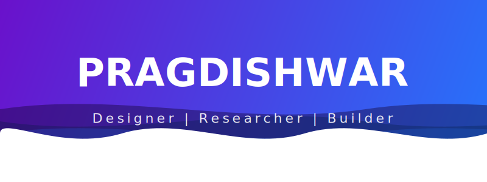

  
   
  
   

  <!-- Socials -->
  
  

# 💫 About Me:
### **About Me :**  
* 🔭 **I’m currently working on** an automated IoT plant irrigation system using an ESP32-CAM, and developing a fintech platform called [**Earn2Equity**](https://github.com/Pragdishwar/earn2equity).
* 👯 **I’m looking to collaborate on** full-stack React and Supabase applications, cloud-based route optimizers (like [**RouteMonk**](https://github.com/Pragdishwar/RouteMonk)), or creative hackathon projects.
* 🤝 **I’m looking for help with** mastering Agent-First frontend development using Google's Antigravity IDE.
* 🌱 **I’m currently learning** Japanese, machine learning concepts, data analytics, and theory of computation.
* 💬 **Ask me about** organizing large-scale tech/cultural events (like [**Borderland Arena**](https://github.com/Pragdishwar/borderland-arena) and Hikari no Matsuri), logo design, or working with microcontrollers.
* ⚡ **Fun fact:** I design tech-themed forensic mystery games like "Digital Archaeology" in my spare time!

# 💻 Tech Stack:
                        

  <h2>📊 Activity Dashboard</h2>

| | |
| :---: | :---: |
|  |  |
|  |  |

 

  
   
  Built by Pragdishwar

